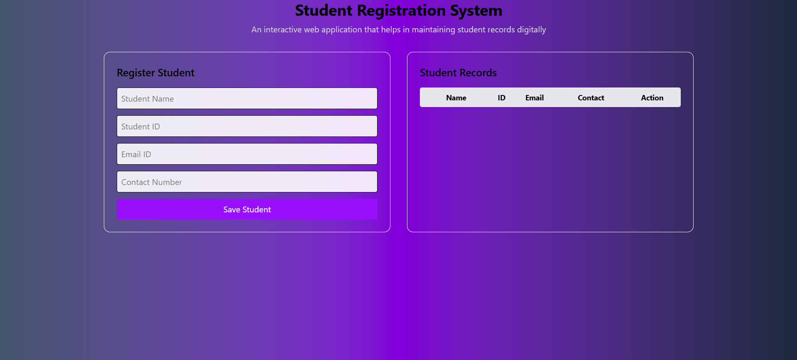

# 🎓 Student Registration System

A modern, responsive student registration management system built with HTML, CSS, and JavaScript. This application allows institutions to efficiently manage student enrollments with a clean and intuitive interface.

## ✨ Features

### Core Functionality
- **Student Registration**: Add new students with comprehensive details
- **View All Students**: Display registered students in an organized table
- **Edit Student Info**: Update existing student records
- **Delete Records**: Remove student entries with confirmation
- **Search & Filter**: Quick search functionality to find students
- **Form Validation**: Ensures all required fields are properly filled
- **Responsive Design**: Works seamlessly on desktop, tablet, and mobile devices

### Data Management
- **Local Storage**: All data persists in browser's local storage
- **Real-time Updates**: Changes reflect immediately in the UI
- **Data Export**: Option to export student data (optional feature)
- **Unique ID Generation**: Automatic student ID assignment

## 🚀 Technologies Used

- **HTML5**: Semantic markup structure
- **CSS3**: Modern styling with Flexbox/Grid
- **JavaScript (ES6+)**: Dynamic functionality and DOM manipulation
- **Local Storage API**: Client-side data persistence

## 📦 Installation & Setup

### Prerequisites
- A modern web browser (Chrome, Firefox, Safari, Edge)
- No server required - runs entirely in the browser

### Steps

1. **Clone or Download the Repository**
   ```bash
   git clone <repository-url>
   cd student-registration-system
   ```

2. **Open in Browser**
   
   Simply open the `index.html` file in your web browser:
   - Double-click on `index.html`, or
   - Right-click → Open with → Your Browser, or
   - Use a local server (optional):
   
   ```bash
   # Using Python
   python -m http.server 8000
   
   # Using Node.js http-server
   npx http-server
   ```

3. **Start Using**
   
   The application is ready to use immediately - no configuration needed!

## 📁 Project Structure

```
student-registration-system/
│
├── index.html          # Main HTML file
├── input.css           # Input styles (if using preprocessor)
├── output.css          # Compiled/main stylesheet
├── script.js           # JavaScript functionality
├── package.json        # Project dependencies (if any)
├── package-lock.json   # Dependency lock file
├── .gitignore          # Git ignore rules
└── README.md           # Project documentation
```

## 🎯 Usage Guide

### Adding a Student

1. Fill in the registration form with student details:
   - Full Name
   - Email Address
   - Phone Number
   - Date of Birth
   - Course/Program
   - Other required fields

2. Click the **"Register Student"** button

3. Student will be added to the table below

### Editing a Student

1. Locate the student in the table
2. Click the **"Edit"** button next to their record
3. Modify the details in the form
4. Click **"Update Student"** to save changes

### Deleting a Student

1. Find the student record in the table
2. Click the **"Delete"** button
3. Confirm the deletion in the popup dialog

### Searching for Students

- Use the search bar at the top to filter students by:
  - Name
  - Email
  - Student ID
  - Course

## 💾 Data Storage

All student data is stored locally in your browser using the **Local Storage API**:

- Data persists between browser sessions
- No data is sent to any server
- Data is specific to the browser and device
- Clear browser data will remove all records

### To Backup Your Data

1. Open browser's Developer Tools (F12)
2. Go to Application → Local Storage
3. Copy the stored data
4. Save it as a backup file

## 📱 Responsive Design

The application is fully responsive and works on:

- ✅ Desktop (1920x1080 and above)
- ✅ Laptops (1366x768)
- ✅ Tablets (768x1024)
- ✅ Mobile Phones (375x667 and above)

## 🎨 Customization

### Changing Colors

Edit the CSS file to customize the color scheme:

```css
:root {
  --primary-color: #3b82f6;
  --secondary-color: #10b981;
  --danger-color: #ef4444;
}
```

### Adding New Fields

1. Add input field in `index.html`
2. Update the JavaScript object structure in `script.js`
3. Modify the table columns to display the new field

## 🐛 Troubleshooting

### Data Not Saving
- Check if browser's Local Storage is enabled
- Ensure you're not in Incognito/Private mode
- Clear browser cache and try again

### Form Not Submitting
- Check browser console for JavaScript errors (F12)
- Ensure all required fields are filled
- Verify email format is correct

### Layout Issues
- Clear browser cache (Ctrl + Shift + Delete)
- Try a different browser
- Check if CSS files are loading properly

## 🔒 Security & Privacy

- All data is stored locally on your device
- No data is transmitted to external servers
- No user authentication required
- Suitable for development/testing purposes

**⚠️ Note**: For production use with sensitive data, implement:
- Backend server with database
- User authentication
- Data encryption
- HTTPS protocol

## 🚀 Future Enhancements

Potential features to add:

- [ ] Export data to CSV/PDF
- [ ] Import data from Excel
- [ ] Advanced filtering and sorting
- [ ] Student photo upload
- [ ] Attendance tracking
- [ ] Grade management
- [ ] Email notifications
- [ ] Multi-user support with authentication
- [ ] Backend integration (Node.js/Express)
- [ ] Database storage (MongoDB/MySQL)

## 📝 Version History

### v1.0.0 (Current)
- Initial release
- Basic CRUD operations
- Local storage implementation
- Responsive design
- Form validation

## 🤝 Contributing

Contributions are welcome! To contribute:

1. Fork the repository
2. Create a feature branch (`git checkout -b feature/AmazingFeature`)
3. Commit your changes (`git commit -m 'Add some AmazingFeature'`)
4. Push to the branch (`git push origin feature/AmazingFeature`)
5. Open a Pull Request

## 📄 License

This project is open source and available for educational purposes.

## 👨‍💻 Author

Created as a student management system project.

## 🙏 Acknowledgments

- Inspiration from modern web applications
- Thanks to the open-source community
- Built with passion for education management

---

**Need Help?** Open an issue or contact the development team.

**⭐ Star this repo if you find it helpful!**


Desktop view
------------


